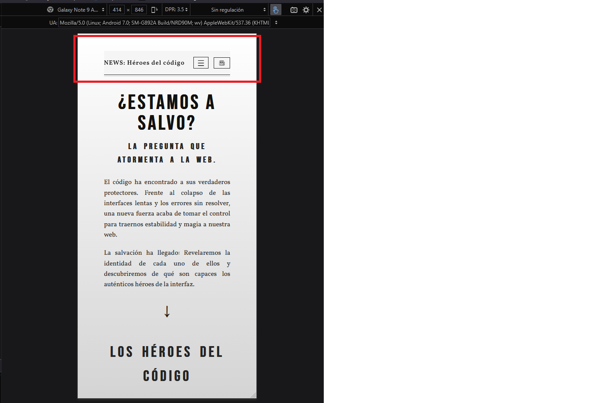
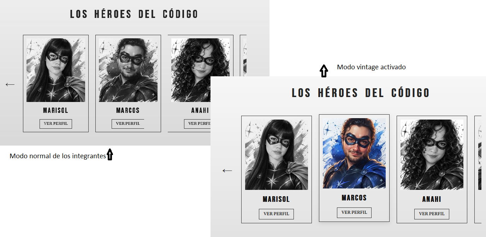
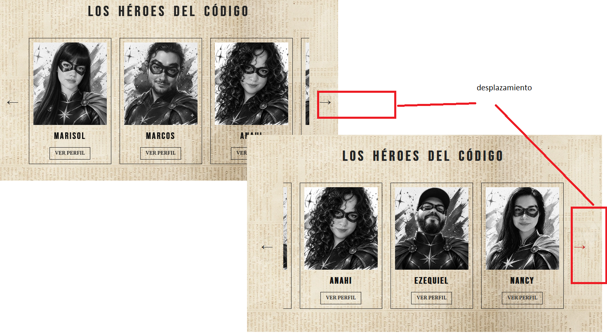
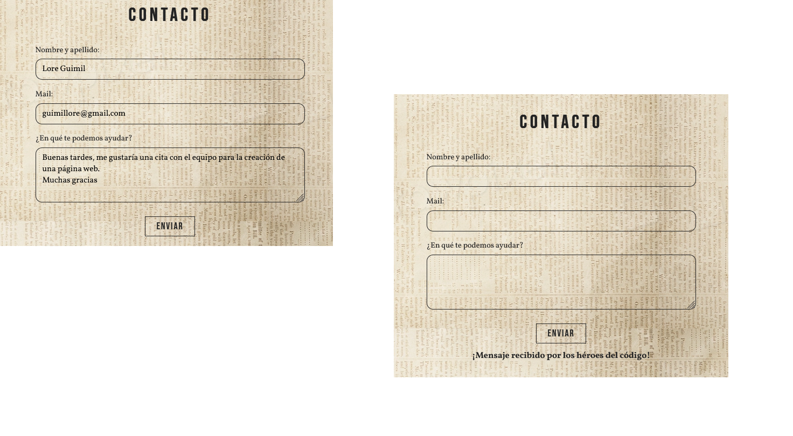
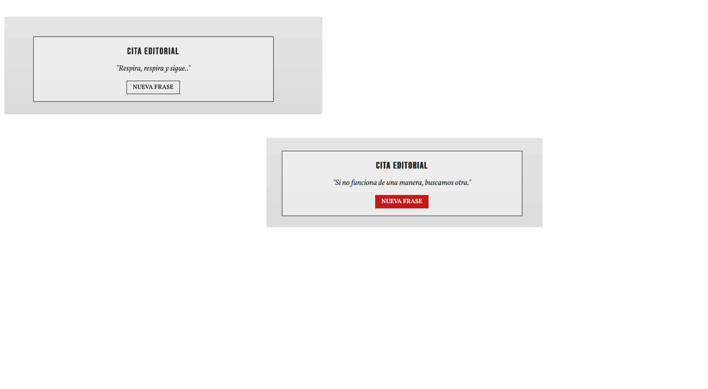
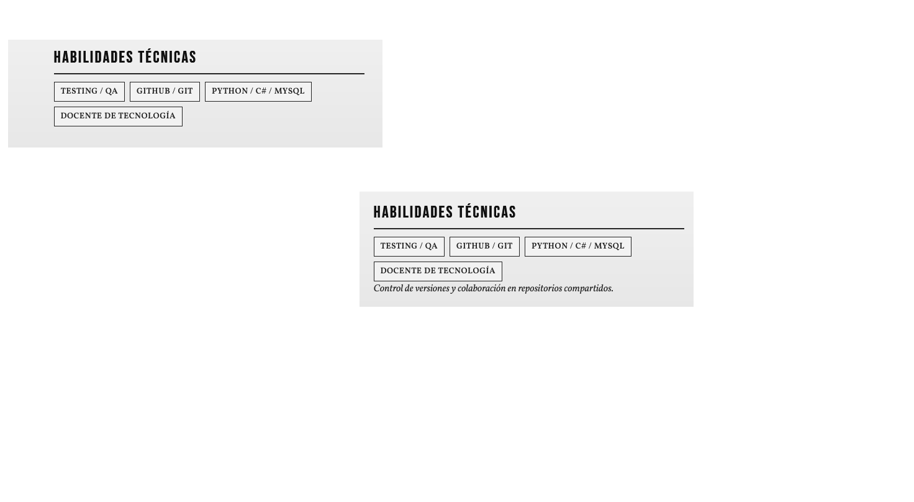

# TPG 1 — Los Héroes del Código
**Desarrollo de Sistemas Web Front End • TSDS • IFTS N°29 • Ciclo 2026**

## Docente de la Materia
* **Martínez, Luciano:** [lucianomartinez.ar](https://lucianomartinez.ar/)

## Integrantes del Grupo 17
* **Alcaraz, Marisol:** [GitHub](https://github.com/Marisol14/PFO1_DSWF) | [Portfolio](https://pfo1-weld.vercel.app/)
* **Artine, Marcos:** [GitHub](https://github.com/fernando-eb2406/dsw-frontend-pfo1) | [Portfolio](https://artine-marcos.vercel.app/)
* **Cardozo, Anahi:** [GitHub](https://github.com/anniecpk/Portafolio-Landing-page) | [Portfolio](https://portafolio-web-landing-page.vercel.app/)
* **Cattalín, Ezequiel:** [GitHub](https://github.com/nilattac/PFO1-Cattalin-Landing-Personal) | [Portfolio](https://pfo-1-cattalin-landing-personal.vercel.app/)
* **Vargas, Nancy:** [GitHub](https://github.com/LuNanVarg/vargasnancy) | [Portfolio](https://vargasnancy.vercel.app/)

## Descripción del Proyecto
Sitio web concebido bajo una identidad visual de periódico editorial retro ("NEWS: Héroes del código"). El proyecto incluye una portada principal interactiva, perfiles individuales detallados para cada integrante, una bitácora de proceso cronológica y 
un sistema de navegación continuo, desarrollado íntegramente con tecnologías nativas sin librerías ni frameworks externos.

## URL de Producción (Vercel)
🔗 [https://los-heroes-del-codigo.vercel.app/](https://los-heroes-del-codigo.vercel.app/)

## Arquitectura y Tecnologías
* **HTML5 Semántico:** Estructura modular basada en `<header>`, `<main>`, `<section>`, `<article>`, `<aside>` y `<footer>`.
* **CSS3 Avanzado:** Maquetación con CSS Grid (`grid-template-areas`), Flexbox, variables personalizadas (`:root`) y diseño adaptable mediante Media Queries calibradas en los breakpoints de **400px**, **600px**, **900px** y **1200px**.
* **JavaScript ES6 Nativo:** Manipulación del DOM sin dependencias, modularizado entre funciones globales (`main.js`) y comportamientos específicos de perfil (`perfil.js`).

## Guía de Estilos
* **Tipografías:**
  * Titulares: `Bebas Neue`
  * Cuerpo de texto y editoriales: `Vollkorn`
* **Paleta Cromática:**
  * Tinta / Texto principal: `#242424`
  * Fondo Periódico (Vintage): `#EAD9C9`
  * Tono Acento: `#C3937C`
  * Hover / Acción: `#C01C1C`

## Funcionalidades e Interactividad JS

* **Navegación Global:** Barra de navegación fija (`position: sticky`) con menú hamburguesa adaptativo para dispositivos móviles.
 

* **Modo Vintage Persistente:** Alternador de edición impresa que almacena la preferencia del usuario en `localStorage`.
   

* **Carrusel de Miembros:** Navegación por desplazamiento horizontal suave (`scrollBy`).


* **Formulario de Contacto:** Captura de eventos `submit`, supresión de recarga por defecto (`preventDefault`) y feedback visual dinámico.
 

* **Citas Editoriales Dinámicas:** Generador de frases aleatorias con algoritmo anti-repetición (`do...while`), personalizado por integrante mediante atributos `data-member`.
 

* **Interacciones Individuales por Perfil:** además de la cita compartida, cada integrante sumó su propia segunda función dinámica, implementada en un `<script>` propio dentro de cada página:
  * **Marisol:** click en su foto alterna entre color y blanco y negro.
      
  
  * **Marcos:** click en cada película muestra/oculta su sinopsis.
       

  * **Anahi:** al pasar el mouse por un disco aparece un dato asociado.
      

  * **Ezequiel:** botón contador de "veces que la vi" por película.
      

  * **Nancy:** click en cada habilidad muestra una descripción corta.
     


## Estructura de Archivos
```text
├── index.html
├── bitacora.html
├── alcaraz-marisol.html
├── artine-marcos.html
├── cardozo-anahi.html
├── cattalin-ezequiel.html
├── vargas-nancy.html
├── css/
│   └── styles.css
├── js/
│   ├── main.js
│   └── perfil.js
└── img/
    ├── periodico.png
    ├── fondo2.png
    ├── noticias-icon.png
    ├── github.png
    ├── web.png
    ├── fotografía de los integrantes.jpeg
    ├── capturas/  (screenshots de las funcionalidades)
    └── [carpetas de fotografías y afiches multimedia de los integrantes (anni, eze, mar, marc, nan)]
```

## Flujo de Trabajo con Git y GitHub
* **Estandarización de Nomenclatura:** Adopción estricta de nombres en minúsculas y guiones medios para archivos (`apellido-nombre.html`) y assets multimedia, evitando fallos de despliegue en entornos Linux/Vercel.
* **Esta entrega (TP1):** para esta primera entrega centralizamos la integración del proyecto en un commit único, priorizando cerrar a tiempo la maquetación, los estilos y la interactividad.
* **Próxima entrega:** a partir de la 2da entrega vamos a trabajar con branches por integrante y Pull Requests revisados antes de mergear a `main`, para que el historial de commits refleje el aporte individual de cada uno.

## Declaración sobre Uso de IA
* **Herramienta y Modelo:** OpenCode (plan gratuito), Gemini (plan estudiantil).
* **Experiencia previa del equipo:** el equipo ya había usado estas herramientas en trabajos anteriores de la cursada.
* **Alcance:** Asistencia técnica en la optimización de selectores responsivos, estructuración semántica en CSS Grid y depuración de lógica en JavaScript nativo.
* **Criterio propio:** El equipo definió la arquitectura del proyecto, la elección y cambio definitivo de las fuentes tipográficas (`Bebas Neue` y `Vollkorn`), el diseño en Figma, la resolución de conflictos y correcciones estructurales en CSS Grid (`grid-template-areas`), la curaduría del contenido multimedia, la redacción de la bitácora y la validación en múltiples navegadores y dispositivos.

## Agradecimientos
Queremos destacar y agradecer el compromiso, la dedicación y el excelente clima de trabajo que mantuvimos a lo largo de todo el desarrollo del proyecto. La predisposición constante para resolver dudas técnicas, coordinar acuerdos de diseño en equipo y apoyarnos en cada entrega fue clave para alcanzar un resultado del cual estamos sumamente orgullosos como Grupo 17.
